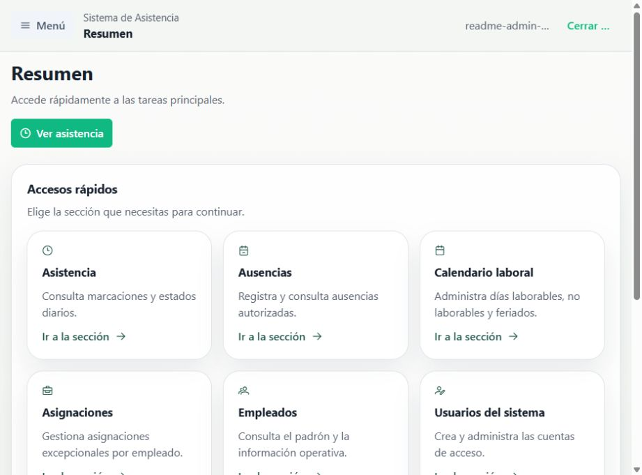
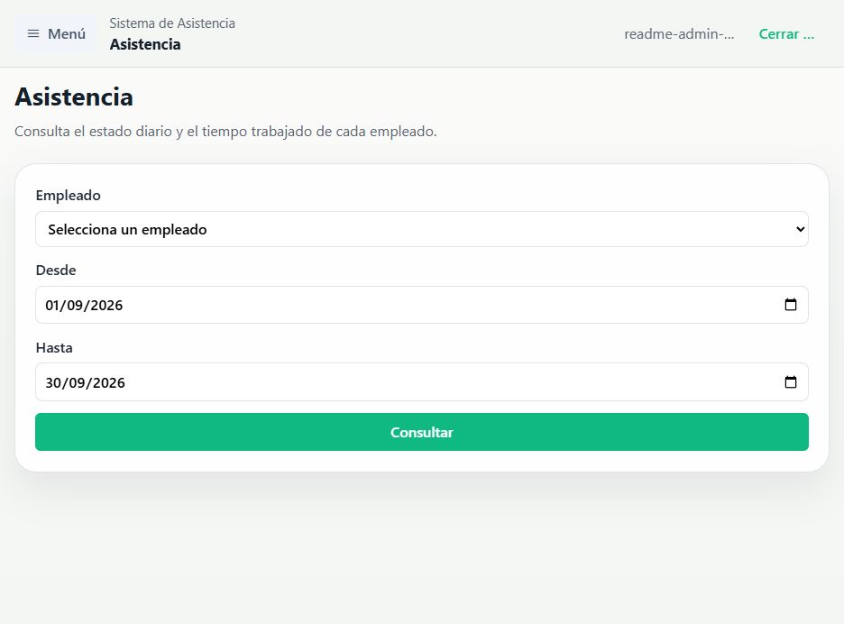
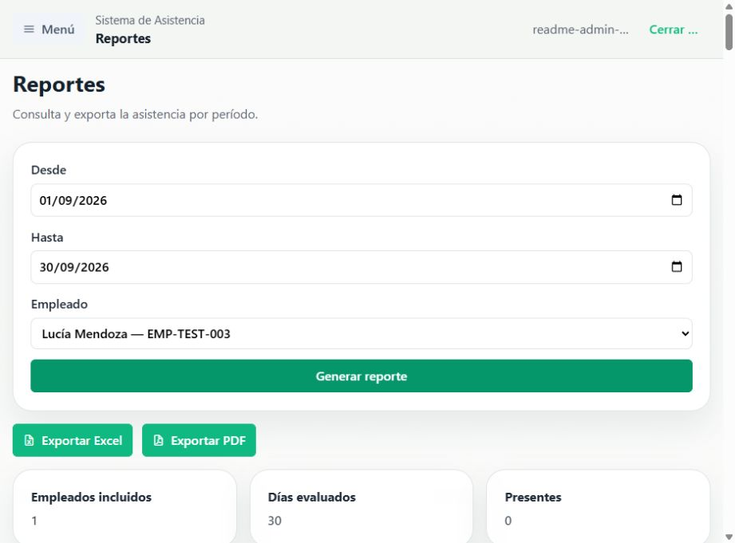
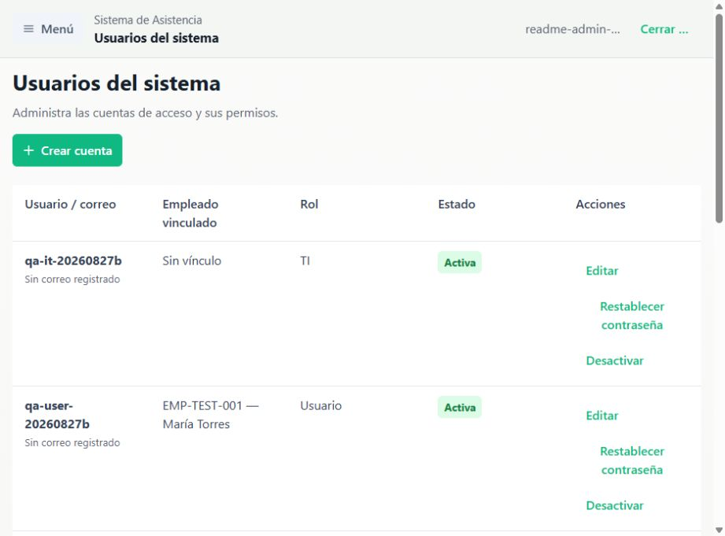
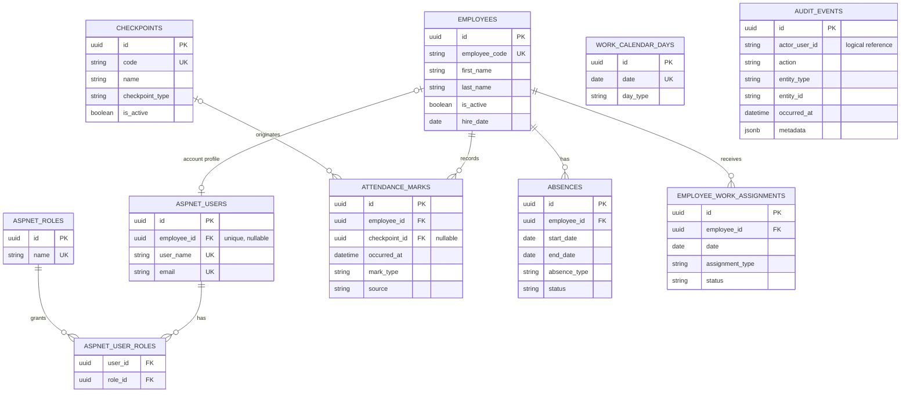

# Sistema de Asistencia

<p>
  
  
  
  
</p>

## Descripción

Sistema web para empresas que registra y administra la asistencia de sus
empleados. Sustituye el control manual de entradas, salidas y pausas por
marcaciones digitales realizadas desde puntos físicos de la organización.

### ¿Qué hace?

Un empleado autenticado escanea un código QR dinámico en un checkpoint, por
ejemplo `EntryExit` o `Cafeteria`. El sistema identifica el punto de marcación,
evalúa el estado de la jornada y registra únicamente la acción que corresponde:
entrada, salida, inicio de almuerzo o fin de almuerzo.

El personal administrativo ve y gestiona la información operativa desde una
misma aplicación: asistencia diaria, ausencias, calendario laboral,
asignaciones especiales, cuentas de usuario y reportes.

### Funcionalidades principales

- Marcación de entrada, salida e inicio/fin de almuerzo mediante checkpoints y QR dinámicos firmados.
- Consulta de horas trabajadas, estados diarios y anomalías de asistencia.
- Gestión de empleados, ausencias, permisos e incidencias.
- Calendario laboral con días laborables, no laborables y feriados.
- Asignaciones excepcionales por empleado y fecha.
- Cuentas con roles `Admin`, `User` e `IT`.
- Gestión técnica de checkpoints por el rol `IT`.
- Reportes de asistencia por período y empleado, con exportación a Excel y PDF.
- Auditoría append-only de acciones administrativas relevantes.

> El sistema puede desplegarse en una intranet corporativa. La versión actual
> no implementa geolocalización ni una restricción de acceso basada en la red
> de la empresa.

## Capturas

<table>
  <tr>
    <td width="50%">
      
      <p align="center"><b>Dashboard</b></p>
    </td>
    <td width="50%">
      
      <p align="center"><b>Control de asistencia</b></p>
    </td>
  </tr>
  <tr>
    <td width="50%">
      
      <p align="center"><b>Reportes</b></p>
    </td>
    <td width="50%">
      
      <p align="center"><b>Administración</b></p>
    </td>
  </tr>
</table>

La aplicación nueva usa:

- ASP.NET Core + EF Core + PostgreSQL en `src/backend/Attendance.Api`
- Vue 3 + TypeScript + Vite en `src/frontend/attendance-web`

El sistema legacy de migración no es el destino de desarrollo ni de migrations de EF Core.

## Arquitectura

- Modular Monolith
- Backend API con módulos:
  - `Work Calendar`
  - `Absences`
  - `Attendance`
  - `Work Assignments`
- Frontend SPA en Vue
- PostgreSQL para desarrollo local

### Modelo de datos

El siguiente diagrama ER resume las tablas de negocio y las relaciones de
identidad que participan directamente en el sistema. Las tablas de soporte de
ASP.NET Identity (claims, logins y tokens), las claves de protección de datos y
los mapeos de migración legacy se mantienen fuera para conservar una lectura
operativa del modelo.



`audit_events` conserva el actor como referencia lógica, sin una clave foránea:
esto permite mantener auditoría append-only aun si cambia el estado de una
cuenta.

## Stack

- ASP.NET Core 10
- C#
- EF Core 10
- PostgreSQL / Npgsql
- Vue 3
- TypeScript
- Vite
- Pinia
- Axios
- Zod
- PrimeVue 4.x
- xUnit
- Vitest

## Estructura del repositorio

```text
src/
  backend/
    Attendance.Api/
  frontend/
    attendance-web/
docs/
  attendance-evaluation-rules.md
  bruno/attendance-api/
```

## Desarrollo local

### PostgreSQL

Usa una base local para la aplicación nueva, por ejemplo:

```text
Host=localhost;Database=attendance_dev;Username=postgres;Password=<your-local-password>
```

No uses la base legacy como destino de desarrollo ni de migrations.

### Backend

Opciones comunes para configurar `ConnectionStrings:DefaultConnection`:

- User Secrets
- variable de entorno `ConnectionStrings__DefaultConnection`

Ejemplo:

```bash
export ConnectionStrings__DefaultConnection="Host=localhost;Database=attendance_dev;Username=postgres;Password=<your-local-password>"
dotnet run --project src/backend/Attendance.Api --launch-profile http
```

URL local esperada:

- API: `http://localhost:5015`
- OpenAPI JSON: `http://localhost:5015/openapi/v1.json`
- Scalar: `http://localhost:5015/docs`

### Frontend

```bash
cd src/frontend/attendance-web
npm install
npm run dev
```

URL local esperada:

- Frontend: `http://localhost:5173`

En desarrollo, Vite proxya `"/api"` hacia `http://localhost:5015`.

## Identity y autorización

La API usa ASP.NET Core Identity con cookies HttpOnly; no usa JWT ni guarda tokens
de sesión en `localStorage`. Los roles internos son `Admin`, `User` e `IT`.
`User` debe estar asociado explícitamente a un empleado; `Admin` e `IT` pueden no
tener asociación laboral. Las rutas personales resuelven el empleado desde la
sesión, nunca desde un `EmployeeId` enviado por el navegador.

En Development, configura cuentas de prueba con User Secrets. Las contraseñas no
deben ir en archivos trackeados:

```bash
dotnet user-secrets set "Identity:SeedUsers:Admin:Username" "<admin>" --project src/backend/Attendance.Api
dotnet user-secrets set "Identity:SeedUsers:Admin:Password" "<strong-password>" --project src/backend/Attendance.Api
dotnet user-secrets set "Identity:SeedUsers:User:Username" "<user>" --project src/backend/Attendance.Api
dotnet user-secrets set "Identity:SeedUsers:User:Password" "<strong-password>" --project src/backend/Attendance.Api
dotnet user-secrets set "Identity:SeedUsers:User:EmployeeId" "<existing-employee-guid>" --project src/backend/Attendance.Api
dotnet user-secrets set "Identity:SeedUsers:IT:Username" "<it>" --project src/backend/Attendance.Api
dotnet user-secrets set "Identity:SeedUsers:IT:Password" "<strong-password>" --project src/backend/Attendance.Api
```

Al iniciar la API en Development se crean únicamente las cuentas configuradas que
no existan. En producción usa secretos externos, HTTPS obligatorio, cookies Secure,
HSTS, una base Identity propia con mínimo privilegio y no expongas Scalar fuera de Development.
Las políticas backend son la fuente de autorización: Admin gestiona módulos de negocio,
User sólo consume `/api/me/attendance` y `/api/me/absences`, e IT sólo accede a áreas técnicas.

Las operaciones mutantes requieren antiforgery. La SPA obtiene el token en
`GET /api/auth/csrf` y lo envía mediante el header `X-CSRF-TOKEN`; Bruno incluye
requests equivalentes en las carpetas Auth y My Data.

### Gestión de cuentas y sesión

Sólo `Admin` puede acceder a **Usuarios del sistema** y administrar cuentas.
Desde esa pantalla puede crear una cuenta, asignar el rol `Administrador`,
`Usuario` o `TI`, activar/desactivar la cuenta y restablecer su contraseña. Una
cuenta `Usuario` debe vincularse a un único empleado; ese vínculo se conserva y
no se cambia desde la interfaz para evitar asignar a una persona la asistencia
de otra.

Al iniciar sesión, **Mantener sesión iniciada** está activado por defecto. Con
esa opción, la cookie HttpOnly persistente dura hasta 30 días y usa renovación
deslizante; sin ella, se emite una cookie de sesión que el navegador elimina al
cerrarse. No se guardan contraseñas ni tokens en `localStorage`. Cerrar sesión
elimina la cookie. Desactivar una cuenta, cambiar su rol o restablecer su
contraseña actualiza su `SecurityStamp`; las cookies se revalidan como máximo
cada cinco minutos.

Para que una cookie persistente sobreviva reinicios, las claves de Data
Protection se persisten en PostgreSQL en la tabla `DataProtectionKeys`, mediante
una migration aditiva. Esa base y sus backups deben tratarse como secretos; no
copies claves manualmente ni uses filesystem efímero. Esta configuración es apta
para el contenedor Linux de Railway y mantiene el mismo `ApplicationName` entre
deploys.

Para crear el primer administrador en producción, usa el bootstrap explícito una
única vez. En el gestor de secretos de producción provisiona
`Identity:BootstrapAdmin:Enabled=true`,
`Identity:BootstrapAdmin:Username` y `Identity:BootstrapAdmin:Password`; inicia
la aplicación, verifica el acceso de la cuenta y elimina las tres claves antes
del siguiente reinicio. El bootstrap sólo se ejecuta en el entorno `Production`,
no sustituye una cuenta existente y no tiene credenciales por defecto. Nunca
incluyas contraseñas en código, Bruno o documentación versionada.

Antes de aplicar la migration `HardenIdentityUserConstraints` en una base ya
usada, revisa y corrige cualquier duplicado de `employee_id` no nulo o de
`NormalizedEmail` no nulo en `AspNetUsers`. La migration convierte ambos índices
en únicos para que la asociación empleado-cuenta y el correo sean invariantes de
PostgreSQL, incluso ante solicitudes simultáneas; si existen duplicados, debe
fallar en lugar de escoger una cuenta arbitrariamente.

## Despliegue y salud

Antes de desplegar, realiza una copia de seguridad, ejecuta las migrations en
una ventana de mantenimiento y verifica la aplicación con:

- `GET /health/live`: el proceso puede responder.
- `GET /health/ready`: PostgreSQL está disponible para la aplicación.

Ambas rutas son anónimas para que el orquestador o balanceador pueda sondearlas;
no incluyen errores de conexión ni secretos en la respuesta. Configura el
monitor de disponibilidad contra `/health/ready` y el de reinicio del proceso
contra `/health/live`.

El inicio de sesión limita a diez intentos por minuto por dirección IP, sin cola.
La protección de lockout de ASP.NET Core Identity se mantiene como segunda capa
por cuenta. Cuando se supera ese límite, la API devuelve `429` y la interfaz
indica esperar un minuto. En producción las excepciones no controladas se devuelven como
Problem Details genérico y no incluyen trazas o secretos.

La publicación de Release incorpora la SPA compilada en `wwwroot`, por lo que la
API y la interfaz se entregan bajo el mismo origen. En producción `AllowedHosts`
debe indicar el nombre DNS real; la aplicación no inicia si permanece en `*`.
El procedimiento Railway —variables, migrations, backups, restore, smoke,
rollback y go-live— está en `docs/production-release.md`.

## Attendance Capture

La captura operativa usa checkpoints físicos y QR dinámicos. IT administra puntos
`EntryExit` y `Cafeteria`; cada QR está firmado, expira en 30 segundos por defecto
(`CheckpointQr:TokenLifetimeSeconds`) y sólo identifica el checkpoint, nunca al
empleado. Un User autenticado escanea el QR y la API resuelve sus acciones válidas
con su asociación Employee/Identity y la zona `America/Lima`.

Las marcas creadas por este flujo registran `Source=DynamicQr` y el `CheckpointId`.
La protección anti-replay es en memoria por token y empleado, apropiada para la
instancia única de intranet prevista. Al reiniciar el servidor se invalidan los QR
activos; una instalación con varias instancias requerirá almacenamiento compartido.

## Base de datos y migrations

## Reporting

Los reportes de asistencia son `AdminOnly`: filtran por período y empleado, muestran
la evaluación diaria y permiten exportar el resultado completo a Excel y PDF.

Aplicar migrations:

```bash
dotnet ef database update --project src/backend/Attendance.Api
```

Crear una nueva migration:

```bash
dotnet ef migrations add <MigrationName> --project src/backend/Attendance.Api
```

## Tests

Cada pull request y cambio a `master` ejecuta GitHub Actions con .NET 10.0.302,
Node 24, pruebas de backend —incluidas las de Testcontainers/PostgreSQL en el
runner Linux— y pruebas/build de frontend. Ningún despliegue debe partir de un
cambio que no tenga esas verificaciones correctas.

### Backend

```bash
dotnet build AttendanceSystem.sln
dotnet test AttendanceSystem.sln
```

### Frontend

```bash
cd src/frontend/attendance-web
npm test
npm run build
```

## Documentación de API

OpenAPI:

- `http://localhost:5015/openapi/v1.json`

Scalar:

- `http://localhost:5015/docs`

Bruno:

- colección versionada en `docs/bruno/attendance-api`

Bruno sigue siendo la colección ejecutable y de ejemplos manuales. Scalar es la referencia visual principal del API en Development.

## Auditoría

La auditoría administrativa es un registro append-only: no existe edición ni
eliminación de eventos. Registra las mutaciones administrativas relevantes de
empleados, ausencias, calendario laboral, asignaciones, checkpoints y cuentas
Identity. Cada evento conserva el actor autenticado, el momento UTC, la acción,
el recurso y metadata mínima; la interfaz la presenta en hora `America/Lima`.

Sólo `Admin` puede consultar `/api/audit-events`. No se registran contraseñas,
hashes, tokens, cookies, CSRF, QR ni información de conexión. El volumen del MVP
es bajo y aún no hay una política automática de retención o purga.

## Documentación adicional

- Reglas de negocio de evaluación diaria: `docs/attendance-evaluation-rules.md`

## Licencia

Este proyecto se distribuye bajo la [licencia MIT](LICENSE).

## Nota sobre legacy

Nueva aplicación:

- ASP.NET Core + Vue
- PostgreSQL local, por ejemplo `attendance_dev`

Sistema legacy:

- Django + PostgreSQL/Supabase
- relevante sólo como referencia o futura migración de datos
